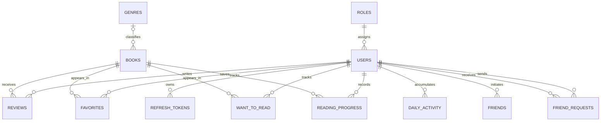

# Database Design

## Scope

The logical model supports book discovery, accounts and roles, reading activity, reviews, personal lists, and friendships. MySQL 8 stores the model through Entity Framework Core; the schema is created and evolved by the migrations in `Migrations/`.

## Entity relationship model



`FRIENDS` and `FRIEND_REQUESTS` each reference `USERS` twice, in sender/recipient roles. Accepted friendships are stored as friend links for both users.

## Tables and keys

| Table | Primary key | Important columns and relationships |
|---|---|---|
| `roles` | `Id` | `Name`; one role can be assigned to many users. |
| `users` | `Id` (Guid) | `Name`, unique `Email`, BCrypt `Password`, `RoleId` FK, active flag, profile fields and timestamps. |
| `refresh_tokens` | `Id` | `UserId` FK, token and expiry/creation timestamps. |
| `genres` | `Id` (Guid) | `Name`; a genre can classify many books. |
| `books` | `Id` (Guid) | Unique `Isbn`, required title/author, optional `GenreId` FK, copy counts, description, rating, page count, PDF/image/source fields and timestamps. |
| `reviews` | `Id` (Guid) | `BookId` and `UserId` FKs, rating, optional text and timestamps. Unique `(BookId, UserId)` limits a user to one review per book. |
| `favorites` | `(UserId, BookId)` | Both columns are FKs; the composite key prevents duplicate favorites. `AddedAt` records when saved. |
| `want_to_read` | `(UserId, BookId)` | Both columns are FKs; the composite key prevents duplicate list entries. |
| `reading_progress` | `Id` (Guid) | `UserId` and `BookId` FKs, current/total pages, percent, status and timestamps. Unique `(UserId, BookId)` keeps one current progress record per user/book. |
| `daily_activity` | `Id` (Guid) | `UserId` FK, activity date and pages read; used to build the reading heatmap. |
| `friends` | `Id` (Guid) | `UserId` and `FriendUserId` are both FKs to `users`; accepted links are represented for both participants. |
| `friend_requests` | `Id` (Guid) | `FromUserId` and `ToUserId` are FKs to `users`; stores request status and timestamps. |

Tables use explicit `snake_case` names. GUID identifiers are used for most domain records; favorites and reading-list entries use composite keys because membership itself is the relationship.

## Integrity and business rules

- Reviews are unique per `(BookId, UserId)`; progress is unique per `(UserId, BookId)`.
- Favorites and want-to-read membership are unique per `(UserId, BookId)` by their composite primary keys.
- Book checks constrain `total_copies` to 1–1000 and `available_copies` to 0–`total_copies`.
- Optional book page count is constrained to 1–100000; optional rating is constrained to 0–5.
- Book text-field maximum lengths are enforced by the EF model: title 255, author 150, ISBN 20, quote 2000, description 5000, image URL 1000, and source URL 1000 characters.
- Reading-progress service logic derives completion status at 100% and contributes page counts to daily activity.
- The review service recalculates the book's aggregate rating after review changes.

The explicit book checks and string limits are configured in `Data/Appdbcontext.cs` and migration `20260917194034_AddBookValidationConstraints`. Other schema changes are versioned in `Migrations/`; do not edit the database schema manually without adding a corresponding migration.

## Creating the schema

Configure `ConnectionStrings:DefaultConnection`, then apply migrations:

```powershell
dotnet ef database update
```

The application seeder creates the base roles and genres. Development-only test data is seeded only when `ASPNETCORE_ENVIRONMENT=Development`.